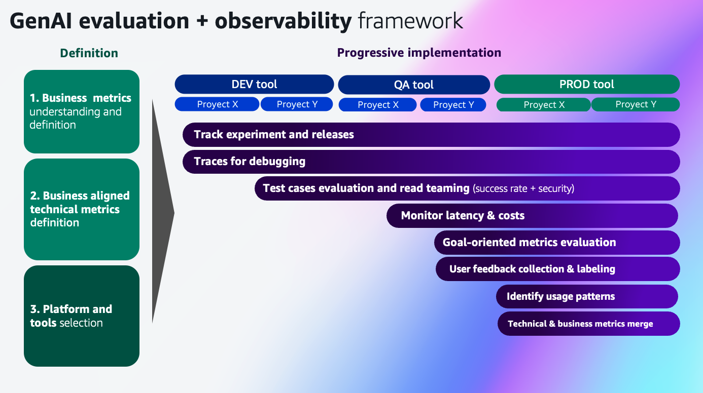

# AWS GenAI Observability Framework

A comprehensive framework for building, monitoring, and evaluating generative AI applications on AWS with enterprise-grade observability, testing, and security controls.



## 🎯 Overview

This framework provides end-to-end observability and evaluation capabilities for GenAI applications built with AWS Bedrock, Strands Agents SDK, and modern observability tools like Langfuse. It covers the complete ML lifecycle from experimentation to production monitoring.

## 🏗️ Architecture

```
┌───────────────────────────────────────────────────────────────────────────────────┐
│                    GenAI Observability Framework                                  │
├───────────────────────────────────────────────────────────────────────────────────┤
│  01-experiment-tracking  │  02-tracing-monitoring  │  03-test-cases-evaluation    │
│  • Prompt optimization   │  • Langfuse tracing     │  • Automated test generation │
│  • A/B testing           │  • AgentCore tracing    │  • Strands agents testing    │
│  • Model comparison      │  • Real-time monitoring │  • Bedrock agents testing    │
├───────────────────────────────────────────────────────────────────────────────────┤
│  04-red-teaming-evaluation  │  05-post-tracing-evaluation                         │
│  • Security testing         │  • RAGAS metrics                                    │
│  • Prompt injection         │  • Performance analysis                             │
│  • Bias detection           │  • Quality assessment                               │
└───────────────────────────────────────────────────────────────────────────────────┘
```

## 🚀 Quick Start

### Prerequisites

```bash
# Install dependencies
pip install boto3 strands-agents==0.1.9 strands-agents-tools==0.1.7 langfuse==3.1.1

# Setup security tools
./setup-security.sh

# Configure AWS credentials
aws configure
```

### Environment Setup

```bash
# Copy and configure environment variables
export LANGFUSE_PUBLIC_KEY="pk-lf-your-key"
export LANGFUSE_SECRET_KEY="sk-lf-your-secret"
export LANGFUSE_HOST="your-langfuse-host"
export AWS_REGION="us-east-1"
```

## 📁 Framework Components

### 01. Experiment Tracking
**Path:** `01-experiment-tracking/`

- **Prerequisites Setup** (`00-prerequisites/`): Environment configuration and Langfuse project setup
- **Prompt Optimization** (`01-prompt-optimization/`): Automated prompt engineering and optimization
- **Experiment Testing** (`02-experiment-testing/`): A/B testing framework with statistical analysis

**Key Features:**
- Multi-model comparison (Claude, Nova, Titan)
- Automated prompt optimization using Lyra
- Statistical significance testing
- Langfuse integration for experiment tracking

### 02. Tracing and Monitoring
**Path:** `02-tracing-and-monitoring/`

- **Langfuse Tracing** (`langfuse tracing/`): Real-time observability with Langfuse v3
- **AgentCore Tracing** (`agentcore tracing/`): OpenTelemetry integration for AWS services

**Key Features:**
- Real-time trace collection
- Performance metrics monitoring
- User feedback integration
- Multi-turn conversation tracking

### 03. Test Cases Evaluation
**Path:** `03-test-cases-evaluation/`

- **Test Case Generator** (`1-test-cases-generator/`): Automated test case generation
- **Strands Agents Evaluator** (`2.1-strands-agents-test-case-evaluator/`): Comprehensive agent testing
- **Bedrock Agents Evaluator** (`2.2-bedrock-agents-test-case-evaluator/`): Native Bedrock agent evaluation

**Key Features:**
- Automated test case generation
- Multi-dimensional evaluation metrics
- Regression testing capabilities
- Performance benchmarking

### 04. Red Team Evaluation
**Path:** `04-red-teaming-evaluation/`

Security-focused evaluation using Promptfoo for:
- Prompt injection detection
- Jailbreak attempt prevention
- Bias and fairness assessment
- PII leakage prevention
- Context hijacking protection

### 05. Post-Tracing Evaluation
**Path:** `05-post-tracing-evaluation/`

Advanced evaluation using RAGAS metrics:
- Answer correctness assessment
- Faithfulness evaluation
- Context relevance scoring
- Response completeness analysis

## Supported Technologies

### AWS Supported Services
- **Amazon Bedrock**: Model endpoints and Guardrails
- **Amazon Bedrock AgentCore**: For Agent runtime hosting and Observability
- **AWS Systems Manager**: Parameter Store for secrets

### Observability Stack
- **Langfuse v3**: Trace collection and analysis
- **OpenTelemetry**: Distributed tracing
- **RAGAS**: LLM evaluation metrics
- **Promptfoo**: Security testing

### Agent Frameworks
- **Strands Agents SDK**: Enterprise agent framework
- **AWS Bedrock Agents**: Native AWS agents

## 🔧 Configuration

### Model Configuration
```json
{
  "models": [
    "anthropic.claude-3-5-sonnet-20241022-v2:0",
    "us.amazon.nova-premier-v1:0",
    "amazon.titan-text-premier-v1:0"
  ],
  "evaluation_metrics": ["correctness", "faithfulness", "relevance"],
  "security_tests": ["injection", "jailbreak", "bias"]
}
```

### Evaluation Configuration
```yaml
aspect_critics:
  - name: "Task/Objective Achieved"
    definition: "Returns 1 if the final answer fulfills the objective"
  - name: "Policy Compliance"
    definition: "Returns 1 if answer respects guidelines"

rubric_scores:
  - name: "Answer Correctness"
    range: "1-5"
    criteria: "Factual accuracy and completeness"
```

## 🚦 Getting Started Workflows

### 1. Basic Agent Evaluation
```bash
cd 03-test-cases-evaluation/2.1-strands-agents-test-case-evaluator
jupyter notebook test-cases-eval-demo.ipynb
```

### 2. Real-time Monitoring Setup
```bash
cd 02-tracing-and-monitoring/langfuse\ tracing
jupyter notebook agent-tracing-strands-langfuse.ipynb
```

### 3. Security Testing
```bash
cd 04-red-teaming-evaluation
jupyter notebook promptfoo_agents_redteam.ipynb
```

### 4. Performance Analysis
```bash
cd 05-post-tracing-evaluation
jupyter notebook agent-post-eval-ragas-langfuse.ipynb
```

## 🔒 Security

This repository implements enterprise-grade security controls:

- **Pre-commit hooks** for secret detection
- **Automated vulnerability scanning** with Trivy
- **Dependency monitoring** with Dependabot
- **Security policy** and vulnerability reporting process

See [SECURITY.md](SECURITY.md) for detailed security information.

## 📈 Monitoring and Alerting

### Langfuse Dashboard
- Real-time trace visualization
- Performance metrics tracking
- User feedback collection
- Cost analysis and optimization

### Custom Metrics
- Agent success rates
- Response quality scores
- Security incident detection
- Performance degradation alerts

## 🤝 Contributing

1. Fork the repository
2. Create a feature branch
3. Run security scans: `pre-commit run --all-files`
4. Submit a pull request

### Development Setup
```bash
# Install development dependencies
pip install -r requirements-dev.txt

# Setup pre-commit hooks
pre-commit install

# Run tests
python -m pytest tests/
```

## 📚 Documentation

- [Security Policy](SECURITY.md)
- [Experiment Tracking Guide](01-experiment-tracking/README.md)
- [Test Case Evaluation Guide](03-test-cases-evaluation/2.1-strands-agents-test-case-evaluator/README.md)

## 🏷️ Tags

`aws` `bedrock` `genai` `observability` `langfuse` `evaluation` `testing` `security` `agents` `llm` `monitoring` `ragas` `promptfoo`

## 📄 License

This project is licensed under the MIT License - see the LICENSE file for details.

## 🆘 Support

For questions and support:
- Create an issue in this repository
- Review the [Security Policy](SECURITY.md) for security-related concerns
- Check existing documentation in component README files

---

**Built with ❤️ for the AWS GenAI community**
